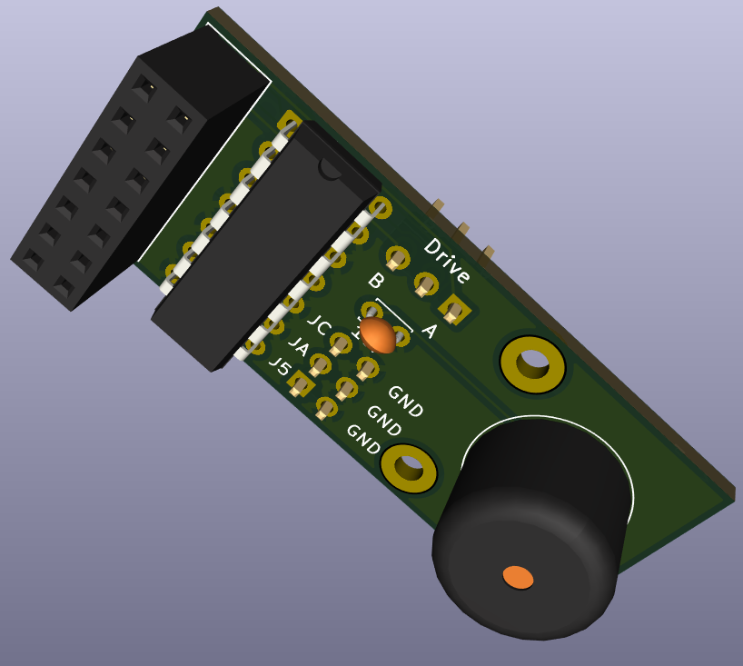

# PCW Gotek Mod

### If you would like to buy a pre-assembled board, you can do so from [PCBWay](https://www.pcbway.com/project/shareproject/PCW_Gotek_Mod_c2c73485.html).

**This project is licensed under the [CERN Open Hardware Licence Version 2: CERN-OHL-S](https://opensource.org/license/cern-ohl-s). If you intend to build and sell this PCB, please make sure that you first read this licence.**

## What?

PCW Gotek Mod is a PCB which, when connected to a Gotek programmed with [FlashFloppy](https://github.com/keirf/FlashFloppy) software, allows the Gotek to correctly respond to the Amstrad PCW's floppy controller signals. This is important when CP/M and LocoScript make certain requests to the controller while booting from 720KB disc images.

Without this mod you must eject, and re-insert the image while booting.

The research, and resolution for the floppy signals problem was done by [Fabrizio Di Vittorio](https://github.com/fdivitto), and the PCW community is very grateful for him [sharing this information in his blog](https://fabriziodivittorio.blogspot.com/2018/05/installazione-gotek-su-amstrad-pcw-9512.html).

I have found that the fix also resolves the issue of CP/M reporting two floppy drives being present on a single drive system, and I recommend that this is fitted to all Goteks used in Amstrad PCWs.

As well as resolving the issues mentioned above, the PCW Gotek Mod also allows the Gotek to be set to drive A or B on a dual drive system, and can be optionally fitted with a piezo buzzer for simulated "floppy" sounds.

The PCB contains passthroughs for the other Gotek pins on the header it occupies, and mounting holes for optional standoffs.

 

## Why?

As explained in [Fabrizio Di Vittorio's blog](https://fabriziodivittorio.blogspot.com/2018/05/installazione-gotek-su-amstrad-pcw-9512.html), when CP/M is booted, it attempts to detect the type of drive it is running on. This is done by stopping the drive motor, and asking the floppy controller to check the status for drive A until it reports that the drive is not ready. As Goteks ignore the motor signal, and always report the drive as ready, the boot process halts until the disk is eject and re-inserted.

 

## How?

As both signals are in negated logic, using one of the 74LS32 logic IC's OR gate ensures that the output is low only when both inputs are low.

A single jumper chooses if the Gotek is drive A or drive B.

### Files

The gerbers [can be found here](gerbers/PCWGotekMod0.6.zip) for submission to your favourite PCB manufacturer.

If you want to check the schematics, you can [find them here](schematics/PCWGotekMod0.6.kicad_sch).

### BOM

| Qty | Part                                                |
| --- | --------------------------------------------------- |
|  1  | 2x7-pin female header                               |
|  1  | SN74LS32 (14-PDIP)                                  |
|  1  | Piezo buzzer max. 3.5mm high *(optional)*             |
|  1  | 1x3-pin male header right-angled                    |
|  1  | Pin header jumper                                   |
|  1  | 1x1-pin male header right-angled *(optional)*         |
|  1  | Male-to-male DuPont wire                            |
|  2  | M2.5 standoffs with matching nuts/screws *(optional)* |

### Assembly Notes

Apart from the 14-pin female pin header and the SN74LS32, the other components can be fitted to either side of the board.

I recommend using right-angled male headers for drive selection and +5V header due to limited head room.

In order to prevent the DuPont wire from being too long, and to reduce the number of total connections, I recommend omitting the +5V header pin, and instead trimmin the DuPont wire to size, stripping the end and soldering it directly to the +5V pad.

Below is the location of the spare +5V pin on the Gotek SFRKC30.AT2 you can use to power the PCW Gotek Mod. Other models may differ.

 

# Links

* [PCW Gotek Mod on PCBWay](https://www.pcbway.com/project/shareproject/PCW_Gotek_Mod_c2c73485.html)
* [Fabrizio Di Vittorio's blog: Installazione Gotek su Amstrad PCW 9512](https://fabriziodivittorio.blogspot.com/2018/05/installazione-gotek-su-amstrad-pcw-9512.html)
* [FlashFloppy Wiki: Hardware Mods](https://github.com/keirf/flashfloppy/wiki/Hardware-Mods)